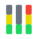
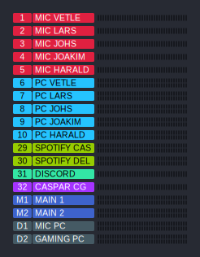
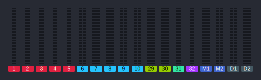

<div align="center">
  <br />
  <h1>Wing Browser Meters (WBM)</h1>
</div>

<p align="center">Your Wing, metered in the browser.</p>

<p align="center">
  <a href="https://github.com/infiniitz/wing-browser-meters/blob/main/LICENSE"></a>
  <a href="https://github.com/infiniitz/wing-browser-meters/pkgs/container/wing-browser-meters"></a>
  <a href="https://nodejs.org/"></a>
  <a href="https://github.com/infiniitz/wing-browser-meters/actions/workflows/docker.yml"></a>
</p>

**Wing Browser Meters** is a small Node.js service that connects to a [Behringer Wing](https://www.behringer.com/product.html?modelCode=P0CQK) on your LAN, subscribes to its meter stream, and pushes levels to browsers over Socket.IO. Pages show live LED-style bars with Wing scribble names, scribble colours (or your overrides), and **PRE** vs **POST** taps where the mixer exposes both. It was aimed first at **OBS Studio custom browser docks** so you can keep meters beside your scenes; the same `/horizontal` and `/vertical` pages work full-screen on tablets, second screens, or wall displays.

**Baseline configuration** (settings UI → persisted in `app-config.json`): choose which strips are meters (channels, auxes, buses, mains, matrices, DCAs), set **PRE/POST** per strip, adjust **horizontal** labels (number/name) or **vertical** row layout, optionally override **label and text colours** per kind instead of following Wing scribble colours, configure **mixer connection** (discovery or fixed IP), set how often **names and colours** refresh from the Wing, and turn on **Low Resource Mode** to cap meter update rate and reduce CPU use. See [Configuration](#configuration) for backing up or sharing that file.

By [Infinitz](https://github.com/infiniitz). MIT licensed.

---

#### `/horizontal`

<p align="center">
  
</p>

#### `/vertical`

<p align="center">
  
</p>

---

## Setup

Published images cover **linux/amd64** and **linux/arm64**:

```text
ghcr.io/infiniitz/wing-browser-meters:latest
```

Package page: [https://github.com/infiniitz/wing-browser-meters/pkgs/container/wing-browser-meters](https://github.com/infiniitz/wing-browser-meters/pkgs/container/wing-browser-meters)

### Option A — Docker Compose (recommended)

Compose pulls the **container image** from GHCR (`docker compose pull` or implicitly on `up`). It does **not** clone the Git repository — you only need a `docker-compose.yml` on disk. Docker creates the host `./data` directory when the volume is first used.

**Minimal install** — make a folder, paste the YAML below into `docker-compose.yml`, then run `docker compose up -d`:

```bash
mkdir wing-browser-meters && cd wing-browser-meters
# create docker-compose.yml with the YAML block below
docker compose up -d
```

**From a git clone** — optional; use this if you want the full project locally (README, source, matching compose file):

```bash
git clone https://github.com/infiniitz/wing-browser-meters.git
cd wing-browser-meters
docker compose pull
docker compose up -d
```

Then open [http://localhost:3000](http://localhost:3000).

Example `docker-compose.yml` (Linux host networking so Wing discovery works out of the box):

```yaml
services:
  wbm:
    image: ghcr.io/infiniitz/wing-browser-meters:latest
    container_name: wing-browser-meters
    restart: unless-stopped
    network_mode: host
    environment:
      PORT: "3000"
    volumes:
      - ./data:/app/data
```

`network_mode: host` is what makes Wing **automatic discovery** work — the container shares the host's LAN interface and can both send the discovery broadcast and receive replies. On macOS / Windows Docker Desktop, host networking is limited; see the network notes below.

### Option B — `docker run` (no Compose)

For users who prefer a single command.

**Linux** (host networking, automatic discovery):

```bash
docker run -d --name wing-browser-meters \
  --restart unless-stopped \
  --network host \
  -e PORT=3000 \
  -v "$(pwd)/data:/app/data" \
  ghcr.io/infiniitz/wing-browser-meters:latest
```

**macOS / Windows Docker Desktop** (bridge networking, fixed Wing IP):

```bash
docker run -d --name wing-browser-meters \
  --restart unless-stopped \
  -p 3000:3000 \
  -e PORT=3000 \
  -e WING_IP=192.168.1.50 \
  -v "$(pwd)/data:/app/data" \
  ghcr.io/infiniitz/wing-browser-meters:latest
```

Open [http://localhost:3000](http://localhost:3000) on the same machine, or `http://<host-LAN-IP>:3000` from any other device on the network.

### Network notes

- **Linux host networking** is the simplest case: discovery broadcast works, the container sees the LAN, and `localhost:3000` is the WBM port directly.
- **Docker Desktop (macOS / Windows)** does not give the container a real LAN interface, so UDP discovery generally won't reach the Wing. Either set `WING_IP` to your console's address up front, or save it once via the settings UI after you can reach the page. Publish a TCP port (`-p 3000:3000`) for the browser.
- **Same-LAN requirement** is from the Wing protocol itself — you can't meter a Wing across the public internet without bridging the two onto the same broadcast domain (e.g. via VPN).

---

## Use as an OBS Custom Browser Dock

OBS Studio can mount any URL as a dockable panel. To add a Wing meter dock:

1. **View → Docks → Custom Browser Docks…**
2. Add a row:
  - **Dock Name:** `Wing Browser Meters` (or whatever you like)
  - **URL:** `http://<wbm-host>:3000/horizontal` (or `/vertical`)
3. Click **Apply**. OBS adds a new dock; drag it to any edge or float it as a window.

Tips:

- **Click the empty area of a meter page** and it navigates back to the settings page — handy for quick tweaks, but be aware that this also happens inside an OBS dock, so be deliberate.

---

## Configuration

All **application config** is stored in a single file, **`app-config.json`**, inside the container directory `/app/data`. With the default Compose setup, the host’s `./data` folder is mounted there, so your live config is `<repo>/data/app-config.json` (or whatever path you bind to `/app/data`).

That file is the whole story: meter list and PRE/POST taps, display layout, label/text colour overrides, Wing connection mode and saved IP, refresh interval, and Low Resource Mode. Use it to **back up** a working setup, **copy** to another machine, or **share** a baseline layout with another operator or venue (watch for sensitive bits such as a saved mixer IP if you publish the file).

The first time the app persists settings it creates `app-config.json` with sensible defaults — you do not need to seed it manually.

**Import / export** from the settings UI is not implemented yet; until then, copy or replace `app-config.json` yourself (with the container stopped if you want a clean swap). See the [Roadmap](#roadmap) for planned import/export.

Override the directory with the **`CONFIG_DIR`** environment variable (see [Environment variables](#environment-variables)).

---

## Environment variables

Set these under `environment:` in Compose, with `-e` on `docker run`, or via an `env_file`.


| Variable     | Default     | Meaning                                                                                                                                               |
| ------------ | ----------- | ----------------------------------------------------------------------------------------------------------------------------------------------------- |
| `PORT`       | `3000`      | HTTP port the app listens on inside the container. With `network_mode: host`, this is also the host port.                                             |
| `WING_IP`    | *(unset)*   | Optional fixed Wing IP used **only when no IP is saved in settings**. A saved IP wins; manual-offline mode (saved IP set to empty) ignores `WING_IP`. |
| `CONFIG_DIR` | `/app/data` | Absolute path inside the container that contains `app-config.json`. The default matches the volume mount.                                             |


---

## REST API

The same operations the settings UI performs are exposed under `/api/`. Useful for automation, dashboards, or scripting layout changes from another tool.


| Method     | Path                      | Purpose                                                                |
| ---------- | ------------------------- | ---------------------------------------------------------------------- |
| GET        | `/api/meters-config`      | Current meter selection (kind / index / postFader).                    |
| POST       | `/api/meters-config`      | Replace the meter selection. Triggers a Wing reconnect.                |
| GET        | `/api/wing-connection`    | Connection summary (mode, configured address, live status).            |
| POST       | `/api/wing-connection`    | Set fixed IP (`null` = discovery, `""` = manual offline, `"a.b.c.d"`). |
| GET        | `/api/wing-scan`          | Run a one-shot LAN scan and return discovered consoles.                |
| GET / POST | `/api/refresh-interval`   | Read / set the names+colours refresh interval (ms).                    |
| GET / POST | `/api/display-layout`     | Read / set number/name label visibility and vertical row layout.       |
| GET / POST | `/api/meter-label-colors` | Read / set per-kind label background overrides.                        |
| GET / POST | `/api/meter-text-colors`  | Read / set per-kind label text colour overrides.                       |
| GET / POST | `/api/low-resource`       | Read / toggle Low Resource Mode.                                       |
| GET        | `/api/channel-names`      | Last-seen Wing scribble names (full console).                          |
| GET        | `/api/channel-colors`     | Last-seen Wing scribble colour ids (full console).                     |


---

## Roadmap

Planned, not yet shipped:

- **Mute state** indication on the bars (Wing `$mute`).
- **More UI customizations** — backgrounds, bar and segment colours, sizing / scale, typography, and other layout tweaks (today only label and text colours are fully themable).
- **Target-level marker** per meter — a visible cue (e.g. line or notch) for a configured nominal or desired level on that strip.
- **Multiple unique views** in a single instance, so several OBS docks can show different meter selections without running multiple containers.
- **Config import / export** — backup, restore, and share configuration from the app (today you manage `app-config.json` manually).
- **More environment variables** — `HOST` / bind address for reverse-proxy installs, configurable Wing reconnect delay, and a read-only mode that disables the settings UI and write APIs for kiosk / OBS-dock deployments.

---

## License

[MIT](LICENSE) — see `LICENSE` and `license` in `package.json`.